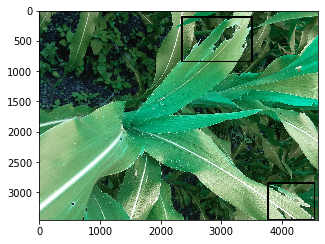

# Corn-Infection-Detection(More work to be done)

## Introduction
Target of this project is to make a system that can detect an infected part of corn leaf. Like below:-

## My efforts
 

**Please Follow [Progress.md](https://github.com/q-viper/Corn-Infection-Detection/blob/master/Progress.md) for progress of this project.**
