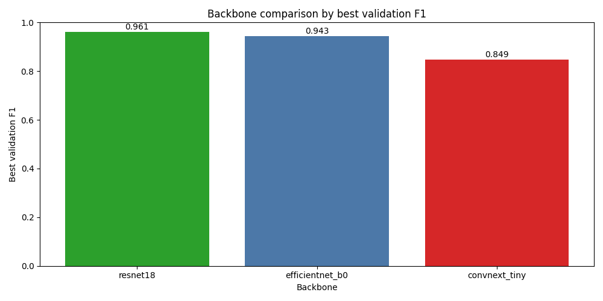
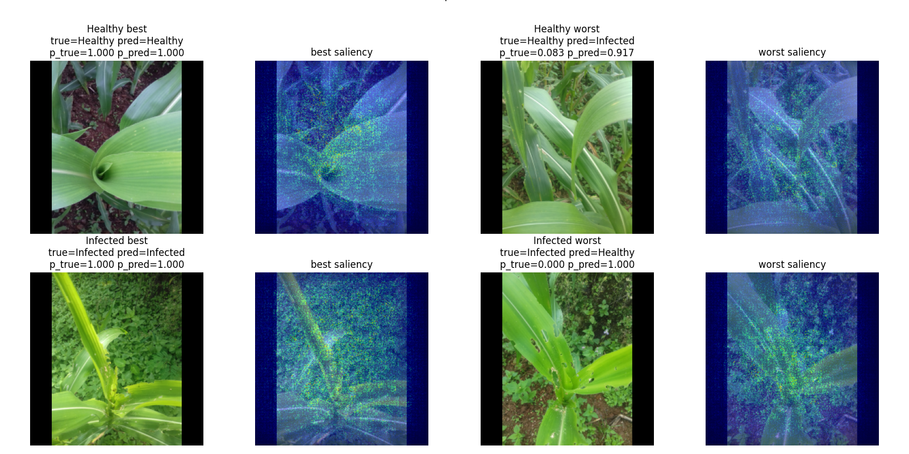

# Corn Leaf Infection Detection
~~This was just another ongoing project that I could not complete.~~ Please find the dataset on [Kaggle](https://www.kaggle.com/qramkrishna/corn-leaf-infection-dataset) and the introductory blog about it on my [GitHub Page](https://q-viper.github.io/2020/10/19/corn-infection-detection-data-preparation/).

> Disclaimer **I am using AI tools for training models but the training logics are mine.**

## Experiments
* I will train a classification model first.
* Then I will train object detection models.
* I will decide which models to use soon.

## Setup
Install this package in the Python environment where your preferred `torch` and `torchvision` versions are already available.

```powershell
pip install torch==2.10.0 torchvision==0.25.0 torchaudio==2.10.0 --index-url https://download.pytorch.org/whl/cu126
pip install -e .
python -c "import torch, torchvision; print(torch.__version__, torchvision.__version__)"
```

The project metadata is in `pyproject.toml`. Torch and Torchvision are intentionally not pinned there, so the training code uses the active environment's Torch build.

## Command Line
Command-line entrypoints use Typer. Check the available options with:

```powershell
python trainers/classification_trainer.py --help
python utils/prepare_annotations.py --help
```

Typer exposes Python option names as hyphenated CLI flags. For example, `batch_size` becomes `--batch-size`, and `progress_image_every` becomes `--progress-image-every`.

## Binary Classification
The classification pipeline supports Torchvision backbones such as `resnet18`, `resnet34`, `resnet50`, `efficientnet_b0`, `efficientnet_b2`, `mobilenet_v3_large`, `convnext_tiny`, `densenet121`, and `regnet_y_400mf`.

Classification transforms use Albumentations. Images are resized with preserved aspect ratio and padded to the configured size, then converted to tensors with simple division by `255.0`. No ImageNet mean/std normalization is applied.

Expected local data layout:

```text
assets/Corn Disease detection/
  Healthy corn/
  Infected/
```

Start with a small local smoke run:

```powershell
python trainers/classification_trainer.py `
  --backbone resnet18 `
  --epochs 2 `
  --batch-size 8 `
  --max-data-per-class 50 `
  --no-pretrained
```

Run the normal classification training:

```powershell
python trainers/classification_trainer.py `
  --backbone resnet18 `
  --epochs 20 `
  --batch-size 16 `
  --progress-image-every 5
```

For multi-backbone experiments, use `notebooks/classification.ipynb`. It is configured for batch size `128`, `50` epochs, F1 comparison across backbones, and best/worst class prediction plots with saliency maps.

Use `--train-backbone` to fine-tune the full backbone. By default, the backbone is frozen and only the classification head is trained.

Use `--pretrained` or `--no-pretrained` to control Torchvision pretrained weights.

Training uses `tqdm` progress bars with running metrics and Loguru for console/file logging. Logs, configs, metrics, checkpoints, and progress images are written under `results/classification/<run_name>/`.

At the beginning of training, sample image grids are saved before the first epoch:
* `sample_images/train_samples.jpg`
* `sample_images/validation_samples.jpg`

Use `--no-log-sample-images` to skip those initial grids, or `--sample-image-count` to change how many samples are shown.

Checkpoint files include both model states and full model files:
* `best_model.pth` - best model state dict.
* `best_model_full.pth` - best full model.
* `last_model.pth` - latest model state dict.
* `last_model_full.pth` - latest full model.

Useful local training options:
* `--image-dir` - path to the dataset root.
* `--backbone` - Torchvision backbone name.
* `--train-backbone` - fine-tune the full model instead of only the head.
* `--no-pretrained` - avoid downloading pretrained weights.
* `--max-data-per-class` - limit samples per class for quick checks.
* `--num-workers` - set local DataLoader workers.
* `--no-log-sample-images` - skip the initial train/validation sample grids.
* `--sample-image-count` - choose how many samples appear in each initial grid.
* `--progress-image-every` - save a validation preview every N epochs.
* `--progress-image-count` - choose how many validation samples appear in each preview.
* `--run-name` - choose the output folder name.

### Annotation Preview
Annotation utilities use OpenCV for image IO and Roboflow Supervision for drawing boxes and labels.

```powershell
python utils/prepare_annotations.py `
  --image-path "assets/Corn Disease detection/Infected/20200612_103505.jpg" `
  --annotation-csv "assets/Corn Disease detection/Infected/Annotation-export.csv" `
  --output-path "outputs/annotation_preview.jpg"
```

### Trained Results
A notebook that was trained on [Kaggle](https://www.kaggle.com/code/qramkrishna/train-corn-leaf-infection-classification) is available as [notebooks/train_classification.ipynb](notebooks/train_classification.ipynb). It shows that ResNet18 performs best.



Saliency maps:



## Project Structure
* `corn_vision/` - package code for datasets, models, losses, trainers, utilities, and shared configs.
* `trainers/` - top-level training entrypoints.
* `utils/` - standalone utility scripts.
* `notebooks/` - original exploration and data preparation notebooks.
* `assets/` - reference assets and local sample data.
